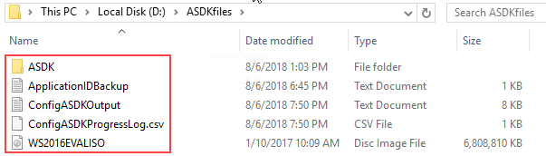

Azure Stack Development Kit Configurator 1811.1
==============

Version Compatibility
-----------
The current version of the ConfigASDK.ps1 script has been **tested with the following versions**:
* ASDK build **1.1811.0.101 (1811)**
* Azure Stack PowerShell Module **1.6.0**

**IMPORTANT** - this version of the ConfigASDK.ps1 script has been tested with ASDK build 1811, Azure Stack PowerShell 1.6.0. and the new AzureRMProfile 2018-03-01-hybrid.  A version that supports the older ASDK builds (1803 etc) can be found in the archive folder, however this will not be maintained. You should upgrade to a later ASDK.

Description
-----------
Once you have **completed the installation of your ASDK**, you need to populate it with content, in order to have a more complete experience. This content may include virtual machine images, extensions, database hosts, app services and more. All of that takes time to install and configure.
The purpose of this ConfigASDK.ps1 script is to automate as much as possible, the post-deployment tasks for the Azure Stack Development Kit

This includes:
* Validates all input parameters
* Checks ASDK host memory for enough resources
* Installs Azure Stack PowerShell and AzureRM modules
* Ensures password for VMs meets complexity required for App Service installation
* Updated password expiration (180 days)
* Disable Windows Update on all infrastructures VMs and ASDK host (To avoid the temptation to apply the patches...)
* Tools installation (Azure Stack Tools)
* Registration of the ASDK to Azure (Optional - enables Marketplace Syndication)
* Windows Server 2016 Datacenter Evaluation (Full + Core) images added to the Platform Image Repository
* Ubuntu Server 16.04-LTS image added to the Platform Image Repository
* Corresponding gallery items created in the Marketplace for the Windows Server and Ubuntu Server images
* Gallery item created for MySQL 5.7 and SQL Server 2017 (both on Ubuntu Server 16.04 LTS)
* Automates adding of Microsoft VM Extensions to Gallery from Marketplace (for registered ASDKs)
* MySQL Resource Provider installation
* SQL Server Resource Provider installation
* Deployment of a MySQL 5.7 hosting server on Ubuntu Server 16.04 LTS
* Deployment of a SQL Server 2017 hosting server on Ubuntu Server 16.04 LTS
* Adding SQL Server & MySQL hosting servers to Resource Providers including SKU/Quotas
* App Service prerequisites installation (SQL Server PowerShell, SQL Server DB VM and Standalone File Server)
* App Service Resource Provider sources download and certificates generation
* App Service Service Principal Created (for Azure AD and ADFS)
* Grants App Service Service Principal Admin Consent (for Azure AD)
* Automates deployment of the latest App Service release using dynamically constructed JSON
* Set new default Quotas for MySQL, SQL Server, Compute, Network, Storage and Key Vault
* Creates a Base Plan and Offer containing all deployed services
* Creates a user subscription for the logged in tenant, and activates all resource providers
* Installs a selection of useful apps via Chocolatey (Putty, Chrome, VS Code, WinDirStat, WinSCP, Python3)
* Configures Python & Azure CLI for usage with ASDK
* MySQL, SQL, App Service and Host Customization can be optionally skipped
* Cleans up download folder to ensure clean future runs
* Transcript Log for errors and troubleshooting
* Progress Tracking and rerun reliability with ConfigASDK database hosted on SqlLocalDB (2017)
* Stores script output in a ConfigASDKOutput.txt, for future reference
* Supports usage in offline/disconnected environments

Additionally, if you encounter an issue, try re-running the script with the same command you used to run it previously. The script is written in such a way that it shouldn't try to rerun previously completed steps.

New in 1809 and newer
-----------
Through the use of parallel jobs, the 1809 version of the ConfigASDK brings significant under-the-hood improvements to make the running of the ConfigASDK script *much* faster. In addition, the management of the process now uses SqlLocalDB, which provides a better level of control and efficiency.

Important Considerations
------------
Firstly, **you must have already deployed the ASDK**. Secondly, for an **Azure AD deployment of the ASDK** (or if you want use ConfigASDK.ps1 with an ADFS deployment of the ASDK, but **register** it to Azure), to run the ConfigASDK.ps1 script, you need to be using a true **organizational account**, such as admin@contoso.onmicrosoft.com or admin@contoso.com, and this account should have global admin credentials for the specified Azure AD directory. Even if you have a non-organizational account, such as an outlook.com account, that has the right level of privilege in Azure AD, the ConfigASDK.ps1 script **uses a -Credential switch for non-interactive login, which doesn’t work with non-organizational accounts**. You will receive an error.

**You do not need to install Azure/AzureStack PowerShell before running the script. The ASDK Configurator will install and configure Azure/AzureStack PowerShell for you. If you have already installed the Azure/AzureStack PowerShell modules, the script will first clean your PowerShell configuration to ensure optimal operation.**

ASDK Host Sizing
------------
The ASDK Configurator will deploy a total of 12 additional virtual machines to support the MySQL, SQL Server, and App Service Resource Providers, should you choose to deploy all the RPs.  You will therefore need an ASDK host machine that has at least 29.5GB free memory to support these additional virtual machines:

* **MySQL RP** - 2 VMs (RP VM, DB Host VM) = **5.5GB**
* **SQL Server RP** - 2 VMs (RP VM, DB Host VM) = **5.5GB**
* **App Service** - 7 VMs (File Server, SQL Host, Front End Scale Set, Shared Worker Tier, Publisher Scale Set, CN0-VM, Management Servers Scale Set) = **23GB**

**Total with all RPs deployed = 34GB in addition to the core running Azure Stack ASDK VMs**

Before you run the ASDK Configurator, ensure that you have enough memory available on your ASDK host system. On a typical ASDK system, the core Azure Stack VMs will already consume between 50-60GB of host memory, so please ensure you have enough remaining to deploy the additional resource providers. As per the updated specs here: https://docs.microsoft.com/en-us/azure/azure-stack/asdk/asdk-deploy-considerations, a system with at least 192GB memory is recommended to evaluate all features.

Offline/Disconnected Support
------------
* Do you want to deploy your ASDK in an environment that **doesn't have internet connectivity**?
* Do you want to download the 5GB+ of required dependencies (Ubuntu image, Database resource providers, App Service binaries, JSON files etc) in advance of running the script?

If you answered **yes** to any of those, you can deploy the ConfigASDK in an offline/disconnected mode. To do so, you should **[read the offline/disconnected documentation.](</deployment/offline/README.md>)**

Step by Step Guidance (for internet-connected ASDK)
------------

### Step 1 - Download the ConfigASDK.ps1 script ###
The first step in the process is to create a local folder on the ASDK host, and then download the ConfigASDK.ps1.

* Deploy your ASDK
* Once complete, login as azurestack\azurestackadmin on your ASDK host.
* Open an elevated PowerShell window and run the following script to download the ConfigASDK.ps1 file:

```powershell
# Create directory on the root drive.
New-Item -ItemType Directory -Force -Path "C:\ConfigASDK"
Set-Location "C:\ConfigASDK"

# Download the ConfigASDK Script.
[Net.ServicePointManager]::SecurityProtocol = [Net.SecurityProtocolType]::Tls12
Invoke-Webrequest http://bit.ly/configasdk -UseBasicParsing -OutFile ConfigASDK.ps1
```
### Step 2 - Previous Run Cleanup ###
If you have run the ASDK Configurator successfully on this physical host before, you may have artifacts left over in your -downloadPath (assuming you use the same path each time) that can affect the next deployment, so please remove any existing files and folders from within your -downloadPath before running the ConfigASDK.ps1 script. If you only have a "Completed" folder, this does not need to be deleted.



### Step 3 - Run the ConfigASDK.ps1 script ###
With the script downloaded successfully, you can move on to running the script. Below, you will find a number of examples to help you run the script, depending on your scenario. Before you use the examples, please read the general guidance below:

**General Guidance**
* For the **-azureDirectoryTenantName**, You can use your "domain.onmicrosoft.com" tenant name, or if you are using a custom domain name in Azure AD, such as contoso.com, you can also use that.
* For the **-downloadPath**, ensure the folder exists, and you have enough space to hold up to 40GB of files. **This should be a path that is local to your ASDK host, NOT a mapped drive - known issues exist with mapped drives at this time**
* **-ISOPath** should point to the Windows Server 2016 Evaluation media that you downloaded with your ASDK files. **Do NOT use Windows Server 2019 or any of the semi-annual releases as these are not supported by the database and App Service resource providers at this time**
* **-azureStackAdminPwd** is the password you used when deploying your ASDK.
* **-VMpwd** is the password assigned to all VMs created by the script. **Important** - App Service installation requires a strong password, at least 12 characters long, with at least 3 of the following options: 1 upper case, lower case, 1 number, 1 special character.
* **-azureAdUsername** and **-azureAdPwd** are the *Service Administrator* credentials you used when you deployed your ASDK host (in Azure AD connected mode)
* Use the **-registerASDK** flag to instruct the script to register your ASDK to Azure.
* Use the **-useAzureCredsForRegistration** flag if you want to use the same *Service Administrator* Azure AD credentials to register the ASDK, as you did when deploying the ASDK.
* If you specify -registerASDK but forget to use -useAzureCredsForRegistration, you will be prompted for alternative credentials.

Usage Examples:
-------------

**Scenario 1** - Using Azure AD for authentication. You wish to register the ASDK to Azure as part of the automated process. For registration, you wish to use the same Azure AD credentials as you used when you deployed your ASDK:

```powershell
.\ConfigASDK.ps1 -azureDirectoryTenantName "contoso.onmicrosoft.com" -authenticationType AzureAD `
-downloadPath "D:\ASDKfiles" -ISOPath "D:\WS2016EVALISO.iso" -azureStackAdminPwd 'Passw0rd123!' `
-VMpwd 'Passw0rd123!' -azureAdUsername "admin@contoso.onmicrosoft.com" -azureAdPwd 'Passw0rd123!' `
-registerASDK -useAzureCredsForRegistration -azureRegSubId "01234567-abcd-8901-234a-bcde5678fghi"
```

**Scenario 2** - Using Azure AD for authentication. You wish to register the ASDK to Azure as part of the automated process. For registration, you wish to use a different set of Azure AD credentials from the set you used when you deployed your ASDK:

```powershell
.\ConfigASDK.ps1 -azureDirectoryTenantName "contoso.onmicrosoft.com" -authenticationType AzureAD `
-downloadPath "D:\ASDKfiles" -ISOPath "D:\WS2016EVALISO.iso" -azureStackAdminPwd 'Passw0rd123!' `
-VMpwd 'Passw0rd123!' -azureAdUsername "admin@contoso.onmicrosoft.com" -azureAdPwd 'Passw0rd123!' `
-registerASDK -azureRegUsername "admin@fabrikam.onmicrosoft.com" -azureRegPwd 'Passw0rd123!' `
-azureRegSubId "01234567-abcd-8901-234a-bcde5678fghi"
```

**Please Note**
* The key difference this time, is that the **-azureRegUsername** and **-azureRegPwd** flags are used, to capture the different set of Azure AD credentials (and therefore, different subscription) for registering the ASDK to Azure.

**Scenario 3** - Using Azure AD for authentication. You choose **not** to register the ASDK to Azure as part of the automated process:

```powershell
.\ConfigASDK.ps1 -azureDirectoryTenantName "contoso.onmicrosoft.com" -authenticationType AzureAD `
-downloadPath "D:\ASDKfiles" -ISOPath "D:\WS2016EVALISO.iso" -azureStackAdminPwd 'Passw0rd123!' `
-VMpwd 'Passw0rd123!' -azureAdUsername "admin@contoso.onmicrosoft.com" -azureAdPwd 'Passw0rd123!'
```

**Scenario 4** - Using ADFS for authentication. You wish to register the ASDK to Azure as part of the automated process. For registration, you will have to use a different set of Azure AD credentials as your ASDK was deployed with ADFS:

```powershell
.\ConfigASDK.ps1 -authenticationType ADFS -downloadPath "D:\ASDKfiles" -ISOPath "D:\WS2016EVALISO.iso" `
-azureStackAdminPwd 'Passw0rd123!' -VMpwd 'Passw0rd123!' -registerASDK `
-azureRegUsername "admin@fabrikam.onmicrosoft.com" -azureRegPwd 'Passw0rd123!' `
-azureRegSubId "01234567-abcd-8901-234a-bcde5678fghi"
```

**Scenario 5** - Using ADFS for authentication. You choose **not** to register the ASDK to Azure as part of the automated process:

```powershell
.\ConfigASDK.ps1 -authenticationType ADFS -downloadPath "D:\ASDKfiles" -ISOPath "D:\WS2016EVALISO.iso" `
-azureStackAdminPwd 'Passw0rd123!' -VMpwd 'Passw0rd123!'
```

Optional Actions
----------------

Use the following switches to skip deployment of additional Resource Providers, or host customization. Note, if you don't specify these switches, the Resource Provider installation/customization will be performed as part of the deployment.

* Use **-skipMySQL** to **not** install the MySQL Resource Provider, Hosting Server and SKU/Quotas.
* Use **-skipMSSQL** to **not** install the Microsoft SQL Server Resource Provider, Hosting Server and SKU/Quotas.
* Use **-skipAppService** to **not** install the App Service pre-requisites and App Service Resource Provider.
* Use **-skipCustomizeHost** to **not** customize your ASDK host with useful apps such as Putty, Visual Studio Code, Google Chrome and more.

In addition, you can choose to skip a particular resource provider deployment, such as -skipMySQL, but later, re-run the Configurator (using the same launch command) and **not** specify the -skipMySQL switch, and the Configurator will add that particular functionality.

Post-Script Actions
-------------------
This script can take many hours to finish, depending on your hardware and download speeds. There are no specific post-script actions to perform after the script has finished.

### Known Issues
* App Service requires Custom Script Extension (CSE) 1.9.0 or newer. Currently, the inbox CSE is version 1.8. Unless you register the ASDK as part of this process, the CSE will be missing and the App Service install will fail. This will be automated in a future release.
* Windows Server 2019 or any of the Windows Server Semi-Annual Channel releases (1709, 1803, 1809) are not validated for support with the database and App Service resource providers, so don't use those builds at this time. Use the Windows Server 2016 evaluation release.
* Do not use a mapped drive for your -downloadPath on your ASDK host. There are known issues which are yet to be resolved. Please use a local drive.

### Troubleshooting & Improvements
This script, and the packages have been developed, and tested, to the best of my ability.  I'm not a PowerShell guru, nor a specialist in Linux scripting, thus, if you do encounter issues, [let me know through GitHub](<../../issues>) and I'll do my best to resolve them.

Likewise, if you are awesome at PowerShell, or Linux scripting, or would like to improve the solution, let me know, and we can collaborate to improve the overall project!