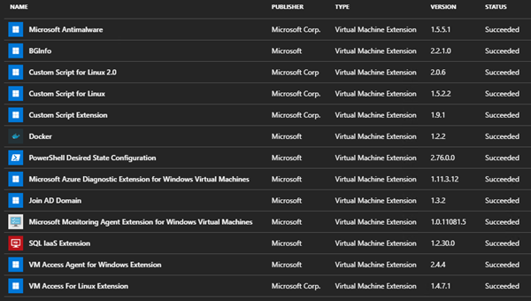

Azure Stack Development Kit Configurator Changelog
==============

Version History
-----------
Here you'll find information on key changes, bug fixes and improvements made by version.

### What's new in version 1904.1?
* Support for App Service 1.6
* Updated to support newer Ubuntu Server 16.04 image
* Updated with latest Windiws Updates and Adobe Flash Security Update downloads
* Check for Azure Stack Admin Login with correct privilege
* Check for hotmail/outlook/live accounts as these fail with non-interactive login

### What's new in version 1904?
* Support for Azure Stack PowerShell 1.7.1
* Updated to support ASDK 1.1904.0.36

### What's new in version 1902?
* Updated to support ASDK 1.1902.0.69
* New -customDomainSuffix for environments where the ASDK default region and domain suffix have been modified during initial ASDK deployment.
* Bug fixes and cleanup

### What's new in version 1901?
* Updated to support ASDK 1.1901.0.95
* Updated to support Azure Stack PowerShell 1.7.0 and AzureRM 2.4.0
* Added support for creating and uploading Windows Server 2019 (Build 17763) into the PIR
* Now using AzCopy for transfer of items into Azure Stack Storage Accounts - Faster transfers
* Updated AZPKG files for VM deployment including newer API versions
* VMs now all deploy with Managed Disks (apart from DB RPs and App Service VMs)
* VM sizes updates for greater efficiency
* Bug fixes and logging cleanup

### What's new in version 1811.2?
* New -serialMode to deploy VMs one at a time - useful for older, lower performance hardware
* Support for Database RPs 1.1.33.0
* Bug fixes and logging cleanup - removal of passwords from logs

### What's new in version 1811.1?
* Updated to support Azure Stack PowerShell 1.6.0
* Adding v1.9.1 of Custom Script Extension when not registering to allow App Service install
* Bug fixes

### What's new in version 1811?
* Updated to support ASDK 1.1811.0.101
* Updated Windows Server image updates with dynamically obtaining Servicing Stack Update
* Increased App Service VM Image size - More reliable
* Bug fixes

### What's new in version 1809.3?
* Adjusted VM sizes for Resource Providers to use less resources
* Added host memory check to avoid running out of memory

### What's new in version 1809.2?
* App Service SQL DB Cleanup for reruns
* Cleans up App Service Resource Group in case of previous run failure - ensures fresh next attempt
* Adjusted Windows Update download to grab KB from different source web page - old one not being updated

### What's new in version 1809.1?
* Support for Database RPs 1.1.30.0
* Support for App Service 1.4 (Update 4)
* Handling of Azure AD tenants without associated subscription
* Bug fixes

### What's new in version 1809?
* Major restructure using PowerShell jobs to enable concurrency of tasks
* Use of SqlLocalDB to track script progress
* Added support for host customization in offline scenarios
* Removal of PSSession usage
* Bug fixes

### What's new in version 1808.1?
* Minor cleanup and bugfixes
* Support for Azure Stack PowerShell module 1.5.0 and AzureRMProfile 2018-03-01-hybrid (Later reverted back due to issues)

### What's new in version 1808?
* Removal of VMSS gallery item installation - this is now built in to the ASDK
* Removal of guest signup launch for admin/user portal
* Support for ASDK build 1.1808.0.97

### What's new in version 1807.1?

* Supports App Service 1.3 (Update 3) - required SQL PS to enable 'Contained DB Authentication'
* For ASDKs that are registered, the script will now download all Microsoft VM Extensions

### What's new in version 1807?

* Support for AzureStack PowerShell Module 1.4.0
* Script now installs PowerShell automatically as part of the process
* Registers your ASDK with a unique but identifiable name, i.e. "asdkreg-hostname-MMdd-HHmmss", such as "asdkreg-azs-node1-0815-090155", which helps you identify which record in Azure, corresponds to which ASDK deployment.
* Support for offline deployment using the new dependencies download script. This generates a .zip file, which will be used by the main ConfigASDK.ps1 script rather than download all dependencies from the internet.
* ConfigASDK.ps1 now runs in 1 of 3 modes: Online, PartialOnline or Offline, depending on internet connectivity tests and availability of ConfigASDKfiles.zip
* Install Python 3.x as part of host configuration step
* Configures Azure CLI and Python for ASDK integration, as part of host configuration step
* Better cleanup of successful runs, for future runs.
* Other fixes and improvements for efficiency

### What's new in version 1805.2?

* Improvements to Windows Server image VHD creation to handle adding of KB4132216 to update Servicing Stack (for build 14393) for future updates (<https://support.microsoft.com/en-us/help/4132216>)

### What's new in version 1805.1?

* Updates to handling Azure subscriptions with multiple Azure AD tenants
* Better error handling for random Add-AzureRmVhd pipeline error
* Added automated App Service quota to base plan, created user subscription and activated RPs for that subscription.

### What's new in version 1805?

* Support for ASDK 1805
* Updated with improvements to Azure account verification
* Added ability to skip RP deployment
* Added run counters
* Bug fixes

### Previous versions

    1804:   Updated with support for ASDK 1804 and PowerShell 1.3.0, bug fixes, reduced number of modules imported from GitHub tools repo
    3.1:    Update added App Service automation, bug fixes, MySQL Root account fix.
    3.0:    Major update for ASDK release 20180329.1
    2.0:    Update for release 1.0.280917.3
    1.0:    Small bug fixes and adding quotas/plan/offer creation
    0.5:    Add SQL 2014 VM deployment
    0.4:    Add Windows update disable
    0.3:    Bug fix (SQL Provider prompting for tenantdirectoryID)
    0.2:    Bug Fix (AZStools download)