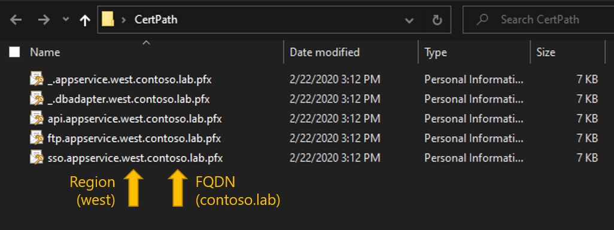

Azure Stack POC Configurator 1910 - Multi-Node Guidance
Experimental Support Only - Limited Testing Performed
==============

If you are using an ASDK and **not** a multinode deployment, **STOP** and **[go back to the main readme.](</deployment/README.md>)**

Version Compatibility
-----------
The current version of the AzSPoC.ps1 script has been **tested with the following versions**:
* Azure Stack build **1.1910.0.58 (1910)**
* Azure Stack PowerShell Module **1.8.0**

**IMPORTANT** - this version of the AzSPoC.ps1 script has been tested with Azure Stack build 1910, Azure Stack PowerShell 1.8.0. and the new AzureRM PowerShell 2.5.0.

Description
-----------
Once you have **completed the deployment of your Azure Stack system**, you need to populate it with content, in order to have a more complete experience for a POC. This content may include virtual machine images, extensions, database hosts, app services and more. All of that takes time to install and configure.
The purpose of this AzSPoC.ps1 script is to automate as much as possible, the post-deployment tasks for an Azure Stack POC.

This includes (**for a multinode POC**):
* Validates all input parameters
* Installs Azure Stack PowerShell and AzureRM modules on your machine used to run the script
* Ensures password for VMs meets complexity required for App Service installation
* Tools installation (Azure Stack Tools)
* Registration of the Azure Stack system to Azure (Optional - enables Marketplace Syndication)
* Windows Server 2016 Datacenter (Full + Core) images added to the Platform Image Repository
* Windows Server 2019 Datacenter (Full + Core) images added to the Platform Image Repository (Optional)
* All Windows Server images are patched with latest SSU and CUs automatically
* Ubuntu Server 16.04-LTS image added to the Platform Image Repository
* Corresponding gallery items created in the Marketplace for the Windows Server and Ubuntu Server images
* Gallery item created for MySQL 5.7, 8.0 and SQL Server 2017 (all on Ubuntu Server 16.04 LTS)
* Automates adding of Microsoft VM Extensions to Gallery from Marketplace (for registered systems)
* MySQL Resource Provider installation
* SQL Server Resource Provider installation
* Deployment of a MySQL 8.0 hosting server on Ubuntu Server 16.04 LTS
* Deployment of a SQL Server 2017 hosting server on Ubuntu Server 16.04 LTS
* Adding SQL Server & MySQL hosting servers to Resource Providers including SKU/Quotas
* App Service prerequisites installation (SQL Server PowerShell, SQL Server DB VM and Standalone File Server)
* App Service Resource Provider sources download and certificates generation
* App Service Service Principal Created (for Azure AD and ADFS)
* Grants App Service Service Principal Admin Consent (for Azure AD)
* Automates deployment of the latest App Service release using dynamically constructed JSON
* Set new default Quotas for MySQL, SQL Server, Compute, Network, Storage and Key Vault
* Creates a Base Plan and Offer containing all deployed services
* Creates a user subscription for the logged in tenant, and activates all resource providers
* MySQL, SQL, and App Service can be optionally skipped
* Cleans up download folder to ensure clean future runs
* Transcript Log for errors and troubleshooting
* Progress Tracking and rerun reliability with AzSPoC database hosted on SqlLocalDB (2017)
* Stores script output in a AzSPoCOutput.txt, for future reference
* Supports usage in offline/disconnected environments

Additionally, if you encounter an issue, try re-running the script with the same command you used to run it previously. The script is written in such a way that it shouldn't try to rerun previously completed steps.

Important Considerations
------------
Firstly, **you must have already deployed the Azure Stack system**. Secondly, for an **Azure AD deployment of the Azure Stack** (or if you want use AzSPoC.ps1 with an ADFS deployment of Azure Stack, but **register** it to Azure), to run the AzSPoC.ps1 script, you need to be using a true **organizational account**, such as admin@contoso.onmicrosoft.com or admin@contoso.com, and this account should have global admin credentials for the specified Azure AD directory. Even if you have a non-organizational account, such as an outlook.com account, that has the right level of privilege in Azure AD, the AzSPoC.ps1 script **uses a -Credential switch for non-interactive login, which doesn’t work with non-organizational accounts**. You will receive an error.

**You do not need to install Azure/AzureStack PowerShell before running the script. The Azure Stack POC Configurator will install and configure Azure/AzureStack PowerShell for you. If you have already installed the Azure/AzureStack PowerShell modules, the script will first clean your PowerShell configuration to ensure optimal operation.**

Offline/Disconnected Support
------------
* Do you want to configure your Azure Stack multinode system in an environment that **doesn't have internet connectivity**?
* Do you want to download the 5GB+ of required dependencies (Ubuntu image, Database resource providers, App Service binaries, JSON files etc) in advance of running the script?

If you answered **yes** to any of those, you can deploy the AzSPoC in an offline/disconnected mode. To do so, you should **[read the offline/disconnected documentation.](</deployment/multinode/offline/README.md>)**

IMPORTANT - Step by Step Guidance (Connected Azure Stack systems)
------------

### Step 1 - Download the AzSPoC.ps1 script ###
The first step in the process is to create a local folder on your workstation, and then download the AzSPoC.ps1.

* Deploy your Azure Stack system
* Once complete, login to your workstation.  **NOTE - this workstation needs to remain connected to the Azure Stack system for the duration of the script execution.**
* Open an elevated PowerShell window and run the following script to download the AzSPoC.ps1 file:

```powershell
# Create directory on the root drive.
New-Item -ItemType Directory -Force -Path "C:\AzSPoC"
Set-Location "C:\AzSPoC"

# Download the AzSPoC Script.
[Net.ServicePointManager]::SecurityProtocol = [Net.SecurityProtocolType]::Tls12
Invoke-Webrequest http://bit.ly/AzSPoC -UseBasicParsing -OutFile AzSPoC.ps1
```

### Step 2 - Previous Run Cleanup ###
If you have run the Azure Stack POC Configurator successfully on this physical host before, you may have artifacts left over in your -downloadPath (assuming you use the same path each time) that can affect the next deployment, so please remove any existing files and folders from within your -downloadPath before running the AzSPoC.ps1 script. If you only have a "Completed" folder, this does not need to be deleted.


### Step 3 - Centralize your certificates ###
In order to use the AzSPoC.ps1 script with a multinode deployment, you will need to import certificates for the App Service and Database Resource Providers, assuming you're going to deploy those RPs.  If so, please read this carefully:

The following table describes the endpoints and certificates required for the SQL and MySQL adapters and for App Service.

|Scope (per region)|Certificate|Required certificate subject and Subject Alternative Names (SANs)|SubDomain namespace|
|-----|-----|-----|-----|
|SQL, MySQL|SQL and MySQL|&#42;.dbadapter.*&lt;region>.&lt;fqdn>*<br>(Wildcard SSL Certificate)|dbadapter.*&lt;region>.&lt;fqdn>*|
|App Service|Web Traffic Default SSL Cert|&#42;.appservice.*&lt;region>.&lt;fqdn>*<br>&#42;.scm.appservice.*&lt;region>.&lt;fqdn>*<br>&#42;.sso.appservice.*&lt;region>.&lt;fqdn>*<br>(Multi Domain Wildcard SSL Certificate<sup>1</sup>)|appservice.*&lt;region>.&lt;fqdn>*<br>scm.appservice.*&lt;region>.&lt;fqdn>*|
|App Service|API|api.appservice.*&lt;region>.&lt;fqdn>*<br>(SSL Certificate<sup>2</sup>)|appservice.*&lt;region>.&lt;fqdn>*<br>scm.appservice.*&lt;region>.&lt;fqdn>*|
|App Service|FTP|ftp.appservice.*&lt;region>.&lt;fqdn>*<br>(SSL Certificate<sup>2</sup>)|appservice.*&lt;region>.&lt;fqdn>*<br>scm.appservice.*&lt;region>.&lt;fqdn>*|
|App Service|SSO|sso.appservice.*&lt;region>.&lt;fqdn>*<br>(SSL Certificate<sup>2</sup>)|appservice.*&lt;region>.&lt;fqdn>*<br>scm.appservice.*&lt;region>.&lt;fqdn>*|

<sup>1</sup> Requires one certificate with multiple wildcard subject alternative names. Multiple wildcard SANs on a single certificate might not be supported by all Public Certificate Authorities

<sup>2</sup> A &#42;.appservice.*&lt;region>.&lt;fqdn>* wild card certificate cannot be used in place of these three certificates (api.appservice.*&lt;region>.&lt;fqdn>*, ftp.appservice.*&lt;region>.&lt;fqdn>*, and sso.appservice.*&lt;region>.&lt;fqdn>*. App Service explicitly requires the use of separate certificates for these endpoints.

**Once you have those certificates, place them into a single folder on your workstation**

**The script requires you to rename the files correctly.  If you wish to use a single wildcard certificate, that contains all the subject alternative names, please make *4 additional copies of the .pfx certificate in the same folder, and rename the copies correctly*. You only need certificates in this folder, if you are installing the App Service or the Database resource providers.  If you are not installing those services, you do not need any .pfx files in this folder.**

**The image below shows a correctly configured certificate folder, where both the App Service and Database resource providers will be deployed:**



So, if you are installing the App Service, you should have 4 .pfx files in this folder.  If you are installing either MySQL or SQL Server, you should have an additional 1 .pfx file, for a total of 5.


### Step 4 - Run the AzSPoC.ps1 script ###
With the script downloaded successfully, you can move on to running the script. Below, you will find a number of examples to help you run the script, depending on your scenario. Before you use the examples, please read the general guidance below:

#### General Guidance ####

Mandatory Parameters | Explanation
:------------ | :-------------
**azureDirectoryTenantName** | You can use your "domain.onmicrosoft.com" tenant name, or if you are using a custom domain name in Azure AD, such as contoso.com, you can also use that.
**downloadPath** | Ensure the folder exists, and you have enough space to hold at least 60-70GB of files. **This should be a path that is local to your workstation, NOT a mapped drive or USB drive - known issues exist with mapped drives/USB drives at this time**
**ISOPath** | Should point to the Windows Server 2016 **MSDN/Visual Studio/VL** media. **Do NOT use Windows Server 2019 or any of the semi-annual releases as these are not supported by the database and App Service resource providers at this time. Evaluation media will not be supported with multinode systems**
**VMpwd** | is the password assigned to all VMs created by the script. **Important** - App Service installation requires a strong password, at least 12 characters long, with at least 3 of the following options: 1 upper case, lower case, 1 number, 1 special character.
**azureAdUsername** | *Service Administrator* username you used when you deployed your Azure Stack system (in Azure AD connected mode).
**azureAdPwd** | *Service Administrator* password you used when you deployed your Azure Stack system (in Azure AD connected mode).
**registerAzS** | Instructs the script to register your Azure Stack system to Azure.
**useAzureCredsForRegistration** | Use this if you want to use the same *Service Administrator* Azure AD credentials to register the Azure Stack system, as you did when deployed the Azure Stack system.
**azureRegSubId** | This is the subscription you'll use to register your Azure Stack system. You will need to have credentials that have enough privielege against this subscription to create resources.
**multiNode** | This switch should be set for a multinode deployment of Azure Stack.
**azsInternalDomain** | This is the domain you specified for the internals of Azure Stack and is not necessarily the same as the FQDN of the portal.
**pepIP** | This is the IP address of your privileged endpoint within your Azure Stack system.  You can provide any of the 3 IPs associated with your 3 ERCs VMs
**pepPwd** | The password associated with your azsInternaldomain\cloudadmin account.
**certPath** | A path that contains all of your certificates you plan to use for the App Service and Database RPs.
**certPwd** | The password associated with the certificates.
**customDomainSuffix** | This is the region and FQDN associated with your Azure Stack deployment, for example such as "west.contoso.com".  If you're not sure, log onto your Azure Stack portal and copy everything after portal., as your customDomainSuffix.

There are also a number of optional parameters that you can supply depending on your deployment needs.

Optional Parameters | Explanation
:------------ | :-------------
**azureRegUsername** | If you are **NOT** using useAzureCredsForRegistration, you will need to provide an Azure AD username that will be used for registration
**azureRegPwd** | If you are **NOT** using useAzureCredsForRegistration, you will need to provide an Azure AD password that will be used for registration
**ISOPath2019** | Should point to the Windows Server 2019 **MSDN/Visual Studio/VL** media. **Note - this will not be used for deployment of any Resource Providers such as the Database RPs, or the App Service - these will still use the 2016 images. Also, evaluation media will not be supported with multinode systems**
**skipMySQL** | **Do not** install the MySQL Resource Provider, Hosting Server and SKU/Quotas.
**skipMSSQL** | **Do not** install the Microsoft SQL Server Resource Provider, Hosting Server and SKU/Quotas.
**skipAppService** | **Do not** install the App Service pre-requisites and App Service Resource Provider.
**azureEnvironment** | If you wish to authenticate/register to an alternative cloud, such as AzureUSGovernment, AzureGermanCloud etc, use **-azureEnvironment** and the name of the cloud. This name can be retrieved using Get-AzureRmEnvironment.

Usage Examples:
-------------

**Scenario 1** - Using Azure AD for authentication. You wish to register the Azure Stack system to Azure as part of the automated process. For registration, you wish to use the same Azure AD credentials as you used when you deployed your Azure Stack system:

```powershell
.\AzSPoC.ps1 -azureDirectoryTenantName "contoso.onmicrosoft.com" -authenticationType AzureAD `
-downloadPath "D:\AzSFiles" -ISOPath "D:\WS2016EVALISO.iso" `
-VMpwd 'Passw0rd123!' -azureAdUsername "admin@contoso.onmicrosoft.com" -azureAdPwd 'Passw0rd123!' `
-registerAzS -useAzureCredsForRegistration -azureRegSubId "01234567-abcd-8901-234a-bcde5678fghi" `
-multiNode -azsInternalDomain "azscontoso" -pepIP "10.15.25.224" -pepPwd 'Passw0rd123!' `
-certPath "D:\AzSCerts" -certPwd 'Passw0rd123!' -customDomainSuffix "west.contoso.com"
```

**Please Note**
* If you also want the script to create and upload Windows Server 2019 images, simply include **-ISOPath2019 "D:\WS2019EVALISO.iso"** and the script will take care of the rest.

**Scenario 2** - Using Azure AD for authentication. You wish to register the Azure Stack system to Azure as part of the automated process. For registration, you wish to use a **different** set of Azure AD credentials from the set you used when you deployed your Azure Stack system:

```powershell
.\AzSPoC.ps1 -azureDirectoryTenantName "contoso.onmicrosoft.com" -authenticationType AzureAD `
-downloadPath "D:\AzSFiles" -ISOPath "D:\WS2016EVALISO.iso" `
-VMpwd 'Passw0rd123!' -azureAdUsername "admin@contoso.onmicrosoft.com" -azureAdPwd 'Passw0rd123!' `
-registerAzS -azureRegUsername "admin@fabrikam.onmicrosoft.com" -azureRegPwd 'Passw0rd123!' `
-azureRegSubId "01234567-abcd-8901-234a-bcde5678fghi" -multiNode -azsInternalDomain "azscontoso" `
-pepIP "10.15.25.224" -pepPwd 'Passw0rd123!' -certPath "D:\AzSCerts" -certPwd 'Passw0rd123!' `
-customDomainSuffix "west.contoso.com"
```

**Please Note**
* The key difference this time, is that the **-azureRegUsername** and **-azureRegPwd** flags are used, to capture the different set of Azure AD credentials (and therefore, different subscription) for registering the Azure Stack system to Azure.

**Scenario 3** - Using Azure AD for authentication. You choose **not** to register the Azure Stack system to Azure as part of the automated process:

```powershell
.\AzSPoC.ps1 -azureDirectoryTenantName "contoso.onmicrosoft.com" -authenticationType AzureAD `
-downloadPath "D:\AzSFiles" -ISOPath "D:\WS2016EVALISO.iso" `
-VMpwd 'Passw0rd123!' -azureAdUsername "admin@contoso.onmicrosoft.com" -azureAdPwd 'Passw0rd123!' `
-multiNode -azsInternalDomain "azscontoso" -pepIP "10.15.25.224" -pepPwd 'Passw0rd123!' `
-certPath "D:\AzSCerts" -certPwd 'Passw0rd123!' -customDomainSuffix "west.contoso.com"
```

**Scenario 4** - Using ADFS for authentication. You wish to register the Azure Stack system to Azure as part of the automated process. For registration, you will have to use a different set of Azure AD credentials as your Azure Stack was deployed with ADFS:

```powershell
.\AzSPoC.ps1 -authenticationType ADFS -downloadPath "D:\AzSFiles" -ISOPath "D:\WS2016EVALISO.iso" `
-VMpwd 'Passw0rd123!' -registerAzS -azureRegUsername "admin@fabrikam.onmicrosoft.com" `
-azureRegPwd 'Passw0rd123!' -azureRegSubId "01234567-abcd-8901-234a-bcde5678fghi" `
-multiNode -azsInternalDomain "azscontoso" -pepIP "10.15.25.224" -pepPwd 'Passw0rd123!' `
-certPath "D:\AzSCerts" -certPwd 'Passw0rd123!' -customDomainSuffix "west.contoso.com"
```

**Scenario 5** - Using ADFS for authentication. You choose **not** to register the Azure Stack system to Azure as part of the automated process:

```powershell
.\AzSPoC.ps1 -authenticationType ADFS -downloadPath "D:\AzSFiles" -ISOPath "D:\WS2016EVALISO.iso" `
-VMpwd 'Passw0rd123!' -multiNode -azsInternalDomain "azscontoso" `
-pepIP "10.15.25.224" -pepPwd 'Passw0rd123!' -certPath "D:\AzSCerts" -certPwd 'Passw0rd123!' `
-customDomainSuffix "west.contoso.com"
```

Post-Script Actions
-------------------
This script can take many hours to finish, depending on your hardware and download speeds. There are no specific post-script actions to perform after the script has finished.

If you wish to use the same Windows machine to run the AzsPoC.ps1 script against more than 1 multi-node system, you will need to clean up the progress database ahead of a fresh run in the future.  In order to do this, close all existing PowerShell windows/sessions, open a fresh Administrative PowerShell console and run the following PowerShell commands.

```powershell
# Clean up progress database
$sqlServerInstance = '(localdb)\MSSQLLocalDB'
Invoke-Sqlcmd -Server $sqlServerInstance -Query "ALTER DATABASE [AzSPoC] SET SINGLE_USER WITH ROLLBACK IMMEDIATE"
Invoke-Sqlcmd -Server $sqlServerInstance -Query "DROP DATABASE [AzSPoC]"

# Clean up files and folders
$scriptLocation = "<Enter path where you have stored your AzSPoC.ps1 file i.e. C:\AzsPoC>"
Remove-Item -Path "$scriptLocation\*" -Force -Recurse -Confirm:$false -ErrorAction SilentlyContinue -Verbose
Remove-Item "$scriptLocation" -Force -Recurse -Confirm:$false -ErrorAction SilentlyContinue -Verbose
```

These commands should remove the AzSPoC database from the local SQLLocalDB instance, and ensure that any future runs of the script, against a different multi-node system, should execute correctly. It will also clean up the location where you previously stored the AzSPoC script, so download a new copy to ensure you're using the most up to date version.

### Known Issues
* A Windows Server 2016 ISO is required.  This should be build 1607 (The RTM release) and not any of the Windows Server Semi-Annual Channel releases (1709, 1803, 1809). These have not been validated for support with the database and App Service resource providers, so don't use those builds at this time. The script will block their usage.
* If you wish to upload Windows Server 2019 images for testing, please use the 17763 build, which is the Windows Server 2019 RTM. All ISOs should be the MSDN/Visual Studio/Volume License media and **NOT** evaluation media, although currently, neither the eval, VL or MSDN media can be converted offline to use Auto VM Activation, so images will expire in 180 days. If this is an issue, **Do not include a 2019 path** and instead, once deployment is complete, download the Windows Server 2019 images from the Marketplace.
* Do not use a mapped drive for your -downloadPath on your workstation. There are known issues which are yet to be resolved. Please use a local drive.

### Troubleshooting & Improvements
This script, and the packages have been developed, and tested, to the best of my ability.  I'm not a PowerShell guru, nor a specialist in Linux scripting, thus, if you do encounter issues, [let me know through GitHub](<../../issues>) and I'll do my best to resolve them.

Likewise, if you are awesome at PowerShell, or Linux scripting, or would like to improve the solution, let me know, and we can collaborate to improve the overall project!