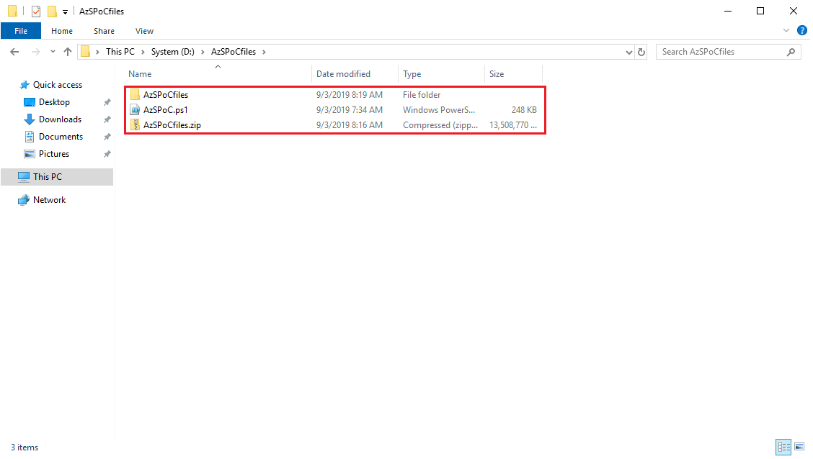

ASDK Configurator 1908.1 | Offline Mode
==============

Who is this for?
-----------
* Have you deployed your ASDK in an environment that doesn't have internet connectivity?
* Do you want to download the 5GB+ of required dependencies (Ubuntu image, Database resource providers, App Service binaries, JSON files etc) in advance of running the script?

If you answered **Yes** to either of those questions, read on....

Version Compatibility
-----------
The current version of the AzSPoCDependencies.ps1 script has been **tested with the following versions**:
* Azure Stack POC Configurator (AzSPoC.ps1) **1908.1**

Description
-----------
The ASDK Configurator script automates the installation of a variety of post-deployment tools, images, resource providers and more. However, the script relies on your ASDK host having an internet connection to download the necessary files. By using the AzSPoCDependencies.ps1 script, you can automate the download of all of the necessary components required by the ASDK Configurator, and zips them up into a convenient single package, ready to be imported, extracted and used by the main ASDK Configurator script.

New in 1902 onwards
-----------
Storage uploads of VHDs and other artifacts now use AzCopy for improved performance. In addition, there is now added support for the **automated creation of Windows Server 2019 images** that will be added to your platform image repository. See the instructions below.

In addition, should you choose to customize your ASDK deployment by using a custom domain suffix, such as west.contoso.lab, instead of local.azurestack.external, the ASDK Configurator now supports this. **NOTE, the if you didn't deploy your ASDK with a different custom domain suffix, you can ignore the -customDomainSuffix parameter**

Important Considerations
------------
The AzSPoCdependencies.ps1 script **requires at least PowerShell 5.0**. This is built into Windows 10, and Windows Server 2016 and is available for other platforms here: <https://go.microsoft.com/fwlink/?linkid=830436>.  The only other requirement for the machine where you will download the dependency files, is that it **requires an internet connection**, which, goes without saying, really.

**You do not need to install Azure/AzureStack PowerShell before running the script. The ASDK Configurator will install and configure Azure/AzureStack PowerShell for you. If you have already installed the Azure/AzureStack PowerShell modules, the script will first clean your PowerShell configuration to ensure optimal operation.**

ASDK Host Sizing
------------
The ASDK Configurator will deploy a total of 12 additional virtual machines to support the MySQL, SQL Server, and App Service Resource Providers, should you choose to deploy all the RPs.  You will therefore need an ASDK host machine that has at least 29.5GB free memory to support these additional virtual machines:

* **MySQL RP** - 2 VMs (RP VM, DB Host VM) = **5.5GB**
* **SQL Server RP** - 2 VMs (RP VM, DB Host VM) = **5.5GB**
* **App Service** - 7 VMs (File Server, SQL Host, Front End Scale Set, Shared Worker Tier, Publisher Scale Set, CN0-VM, Management Servers Scale Set) = **23GB**

**Total with all RPs deployed = 34GB in addition to the core running Azure Stack ASDK VMs**

Before you run the ASDK Configurator, ensure that you have enough memory available on your ASDK host system. On a typical ASDK system, the core Azure Stack VMs will already consume between 50-60GB of host memory, so please ensure you have enough remaining to deploy the additional resource providers. As per the updated specs here: https://docs.microsoft.com/en-us/azure/azure-stack/asdk/asdk-deploy-considerations, a system with at least 192GB memory is recommended to evaluate all features.

Running on older/low perf hardware
------------
If your system doesn't have SSDs, or is an older model, the ASDK Configurator may experience issues during parallel deployment of virtual machines. This may also be true in environments where you have virtualized the ASDK, and are running it nested on an alternative virtualization/cloud platform, such as ESXi, or in an Azure VM. If that's the case, it's recommended to run the AzSPoC.ps1 script with the **-serialMode flag**, and this will instruct the script to deploy any VMs, one at a time. This takes a little longer, but offers increased reliability on systems with lower levels of performance.

Step by Step Guidance - Download Dependencies
------------

### Step 1 - Download the AzSPoCdependencies.ps1 script ###
**On an internet-connected machine**, to download the AzSPoCdependencies.ps1 script, **open an administrative PowerShell console**, and run the following commands.  You can change the -Path to a different file path on your machine if you prefer.

```powershell
# Create directory on the root drive.
New-Item -ItemType Directory -Force -Path "C:\AzSPoCfiles"
Set-Location "C:\AzSPoCfiles"

# Download the AzSPoC Script.
[Net.ServicePointManager]::SecurityProtocol = [Net.SecurityProtocolType]::Tls12
Invoke-Webrequest http://bit.ly/AzSPoCdependencies -UseBasicParsing -OutFile AzSPoCdependencies.ps1
```

Once you've downloaded the script, you can run it using the following guidance. The length of time the script takes to execute will depend on your internet connection speed, and the speed of you local storage. In my lab, on relatively modern hardware, with an 88Mbps internet connection (according to Fast.com), it took 31 minutes to complete the process. The script will download the required dependencies, such as an Ubuntu image, Database resource providers, App Service binaries and more. It will also grab your Windows Server 2016 ISO file (and optionally, Windows Server 2019), and zip them all up into a convenient zip file.

### Step 2 - Run the AzSPoCdependencies.ps1 script ###

```powershell
# Initiate the downloader.
.\AzSPoCdependencies.ps1 -downloadPath "C:\AzSPoCfiles" -ISOPath "C:\WS2016EVAL.iso"
```

Alternatively, if you would like to include Windows Server 2019:

```powershell
# Initiate the downloader.
.\AzSPoCdependencies.ps1 -downloadPath "C:\AzSPoCfiles" -ISOPath "C:\WS2016EVAL.iso" -ISOPath2019 "C:\WS2019EVAL.iso"
```

**General Guidance**

* For the **-downloadPath**, ensure the folder exists, and you have enough space to hold up to 20GB of files
* **-ISOPath** should point to the Windows Server 2016 Evaluation media that you downloaded with your ASDK files. **Do NOT use Windows Server 2019 or any of the semi-annual releases as these are not supported by the database and App Service resource providers at this time**
* **-ISOPath2019** is optional, and should point to the Windows Server 2019 Evaluation media that you can download from here: https://www.microsoft.com/en-us/evalcenter/evaluate-windows-server-2019. **Note - this will not be used for deployment of any Resource Providers such as the Database RPs, or the App Service - these will still use the 2016 images**

The script will create a folder structure within your chosen **downloadPath**, and will create a copy of your ISO file, and include this within the download path also. By the end of the process, your download path will contain items (and subdirectories etc.):
* AzSPoCfiles (Directory)
* AzSPoCfiles.zip (Zip file with all key files)
* AzSPoC.ps1 (Script)
* AzSPoCDependencyLogDateTime.txt (Log file)

### Step 3 - Copy files to target ASDK host ###
Of the files produced in the previous step, you should copy the **AzSPoCfiles.zip** file and the **AzSPoC.ps1** script to your target ASDK host. For my examples, I've copied my AzSPoC.ps1 and AzSPoCfiles.zip to my D:\, as shown below:



### Step 4 - Run the AzSPoC.ps1 script ###
With your AzSPoCfiles.zip and AzSPoC.ps1 files copied to your ASDK host, you can now run the main AzSPoC.ps1 script to customize your ASDK host.  When the AzSPoC.ps1 script runs, it will now make 2 important checks.

1. Can this ASDK host reach the internet? - the script will run some basic internet connectivity tests
2. Has the user specified -AzSPoCOfflineZipPath and a valid zip file?

If the ASDK host can reach the internet, **and** the -AzSPoCOfflineZipPath has been provided, the ASDK Configurator will operate in a **PartialOnline** mode, where it will use the zip file for most dependencies, but will grab a few pieces of extra information (some azpkg files, some scripts) from the internet when required.

If your ASDK host cannot reach the internet, **and** the -AzSPoCOfflineZipPath has been provided, the ASDK Configurator will operate in an **Offline** mode, and will use the zip file for all dependencies and can operate completely disconnected from the internet.

There are certain combinations that cannot work, for instance, choosing Azure AD as your authentication mode, or choosing to register your ASDK to Azure but failing the internet connection tests. The ASDK Configurator will test for these scenarios and error gracefully if it encounters them.

**NOTE** - when providing the zip file path, you **do not** have to provide the Windows Server 2016 ISO (and optionally, the 2019 ISO) path. The script assumes the ISO file is contained within your zip file and will be located automatically.

**NOTE** - If you have run the ASDK Configurator successfully on this host before, you may have artifacts left over in your -downloadPath that can affect the next deployment, so please remove any existing files and folders from within your -downloadPath before running the AzSPoC.ps1 script.


Usage Examples:
-------------
**General Guidance**
* For the **-downloadPath**, ensure the folder exists, and you have enough space to hold up to 40GB of files.
* If you chose to customize the initial deployment of your ASDK by changing the region (default = "local") or the domain suffix (default = "azurestack.external"), you can use the flag **-customDomainSuffix** along with a correctly formed region and domain suffix, such as "west.contoto.com"

### PartialOnline Scenarios

**Scenario 1** - Using Azure AD for authentication. You wish to register the ASDK to Azure as part of the automated process. For registration, you wish to use the same Azure AD credentials as you used when you deployed your ASDK. You have provided a valid -AzSPoCOfflineZipPath:

```powershell
.\AzSPoC.ps1 -azureDirectoryTenantName "contoso.onmicrosoft.com" -authenticationType AzureAD `
-downloadPath "D:\AzSPoCfiles" -AzSPoCOfflineZipPath "D:\AzSPoCfiles.zip" -asdkHostPwd 'Passw0rd123!' `
-VMpwd 'Passw0rd123!' -azureAdUsername "admin@contoso.onmicrosoft.com" -azureAdPwd 'Passw0rd123!' `
-registerASDK -useAzureCredsForRegistration -azureRegSubId "01234567-abcd-8901-234a-bcde5678fghi"
```

**Scenario 2** - Using Azure AD for authentication. You wish to register the ASDK to Azure as part of the automated process. For registration, you wish to use a different set of Azure AD credentials from the set you used when you deployed your ASDK. You have provided a valid -AzSPoCOfflineZipPath:

```powershell
.\AzSPoC.ps1 -azureDirectoryTenantName "contoso.onmicrosoft.com" -authenticationType AzureAD `
-downloadPath "D:\AzSPoCfiles" -AzSPoCOfflineZipPath "D:\AzSPoCfiles.zip" -asdkHostPwd 'Passw0rd123!' `
-VMpwd 'Passw0rd123!' -azureAdUsername "admin@contoso.onmicrosoft.com" -azureAdPwd 'Passw0rd123!' `
-registerASDK -azureRegUsername "admin@fabrikam.onmicrosoft.com" -azureRegPwd 'Passw0rd123!' `
-azureRegSubId "01234567-abcd-8901-234a-bcde5678fghi"
```

**Scenario 3** - Using Azure AD for authentication. You choose **not** to register the ASDK to Azure as part of the automated process. You have provided a valid -AzSPoCOfflineZipPath:

```powershell
.\AzSPoC.ps1 -azureDirectoryTenantName "contoso.onmicrosoft.com" -authenticationType AzureAD `
-downloadPath "D:\AzSPoCfiles" -AzSPoCOfflineZipPath "D:\AzSPoCfiles.zip" -asdkHostPwd 'Passw0rd123!' `
-VMpwd 'Passw0rd123!' -azureAdUsername "admin@contoso.onmicrosoft.com" -azureAdPwd 'Passw0rd123!'
```

**Scenario 4** - Using ADFS for authentication. You wish to register the ASDK to Azure as part of the automated process. For registration, you will have to use a different set of Azure AD credentials as your ASDK was deployed with ADFS. You have provided a valid -AzSPoCOfflineZipPath:

```powershell
.\AzSPoC.ps1 -authenticationType ADFS -downloadPath "D:\AzSPoCfiles" -AzSPoCOfflineZipPath "D:\AzSPoCfiles.zip" `
-asdkHostPwd 'Passw0rd123!' -VMpwd 'Passw0rd123!' -registerASDK `
-azureRegUsername "admin@fabrikam.onmicrosoft.com" -azureRegPwd 'Passw0rd123!' `
-azureRegSubId "01234567-abcd-8901-234a-bcde5678fghi"
```

**Scenario 5** - Using ADFS for authentication. You choose **not** to register the ASDK to Azure as part of the automated process. You have provided a valid -AzSPoCOfflineZipPath:

```powershell
.\AzSPoC.ps1 -authenticationType ADFS -downloadPath "D:\AzSPoCfiles" -AzSPoCOfflineZipPath "D:\AzSPoCfiles.zip" `
-asdkHostPwd 'Passw0rd123!' -VMpwd 'Passw0rd123!'
```

### Offline Scenarios

**Scenario 6** - This is a **disconnected scenario**. You **cannot** use Azure AD, so you are using ADFS for authentication. You **cannot** register the ASDK to Azure as part of the automated process as you have no internet connection. You have provided a valid -AzSPoCOfflineZipPath.

```powershell
.\AzSPoC.ps1 -authenticationType ADFS -downloadPath "D:\AzSPoCfiles" -AzSPoCOfflineZipPath "D:\AzSPoCfiles.zip" `
-asdkHostPwd 'Passw0rd123!' -VMpwd 'Passw0rd123!'
```

### Optional Actions

Use the following switches to skip deployment of additional Resource Providers, or host customization. Note, if you don't specify these switches, the Resource Provider installation/customization will be performed as part of the deployment.

* Use **-skipMySQL** to **not** install the MySQL Resource Provider, Hosting Server and SKU/Quotas.
* Use **-skipMSSQL** to **not** install the Microsoft SQL Server Resource Provider, Hosting Server and SKU/Quotas.
* Use **-skipAppService** to **not** install the App Service pre-requisites and App Service Resource Provider.
* Use **-skipCustomizeHost** to **not** customize your ASDK host with useful apps such as Putty, Visual Studio Code, Google Chrome and more.

In addition, you can choose to skip a particular resource provider deployment, such as -skipMySQL, but later, re-run the Configurator (using the same launch command) and **not** specify the -skipMySQL switch, and the Configurator will add that particular functionality.

Post-Script Actions
-------------------
The AzSPoC.ps1 script can take over 6 hours to finish, depending on your hardware. An offline deployment will generally be quicker than a connected one, as you have already downloaded the relevant files in advance.

### Known Issues
* A Windows Server 2016 ISO is required.  This should be build 1607 (The RTM release) and not any of the Windows Server Semi-Annual Channel releases (1709, 1803, 1809). These have not been validated for support with the database and App Service resource providers, so don't use those builds at this time. The script will block their usage.
* If you wish to upload Windows Server 2019 images for testing, please use the 17763 build, which is the Windows Server 2019 RTM and can be downloaded from here: https://www.microsoft.com/en-us/evalcenter/evaluate-windows-server-2019
* Do not use a mapped drive for your -downloadPath on your ASDK host. There are known issues which are yet to be resolved. Please use a local drive.

#### Troubleshooting & Improvements ####
This script, and the packages have been developed, and tested, to the best of my ability.  I'm not a PowerShell guru, nor a specialist in Linux scripting, thus, if you do encounter issues, [let me know through GitHub](<../../issues>) and I'll do my best to resolve them.

Likewise, if you are awesome at PowerShell, or Linux scripting, or would like to improve the solution, let me know, and we can collaborate to improve the overall project!
